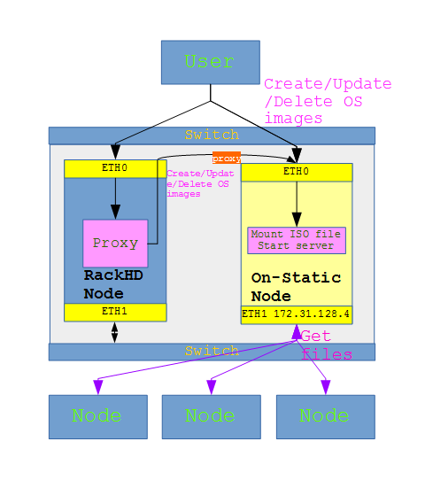

# on-static

__`on-static` is a tool that help [RackHD](https://github.com/rackhd) users to
manage static file resources like os images and microkernel images.

RackHD has an built-in static file server that is used by OS install workflow. An small [setup script](https://github.com/RackHD/on-tools/blob/master/scripts/setup_iso.py) will help users to mount the os images. It's running great as long as the amount of managed nodes is not too many so that the static file server will not consume to much hardware resouces (CPU, memory, etc). 

As long as users trying to scale up the managed nodes, they would think to move the static server out to a seperate hardware. RackHD allows user to use a standalone file server and on-static is meant to simplify the step to setup a standalone static file server, and provide a very easy way of managing os images and iso files. 

Furture support may include management of other static resources
like microkernel and overlayfs. Furture plan also includes management of skupack files but __this is not implemented so far.__

## Introduction

With `on-static`, users can

* **Create http server** that servers operation system images used for [RackHD](https://github.com/rackhd) OS installation. OS images are mounted from iso files that can be loaded from different sources.
* **Mount uploaded iso file** and expose it from http server.
* **Manage iso** files. Users can list in-store iso files, upload a new iso file, delete a in-store iso file.
* **Manage microkernel files. Users can get/upload/delete microkernel files used in RackHD node discovery, including vmlinuz, initrd, basefs and overlay fs image files.
* **Restore** settings after service restart. On-static service store user image settings on file-based persistant storage. Evertime on-static service get started, it will load the user image settings from the storage and get everything setup. 

Two http servers will be created by default:

* The northbound: Handles user requests like managing(list/create/delete) an OS image, or managing(list/create/delete) an iso file.
* The southbound: The http file server.

## Installation

Install on-static is quite straight forward.

    git clone https://github.com/cgx027/on-static.git
    cd on-static
    npm install

## Running

    sudo node index.js

The northbound API will by default listen at 0.0.0.0:7070, and the southbound will by default listen at 0.0.0.0:9090. Those IP addresses and ports are user configurable.

You can also run it as a Linux service. Install the service:

    sudo ./install

And then run the service:

    sudo service on-static start

The log files are located at:

    /var/log/on-static/on-static.log


## Deploy

It's recommend to doploy on-static on a standalone host to offload the host that runs RackHD.

The host running on-static better to have two NICs, one for northbond API and one for southbond API. The NIC for southbound API should be accessible by RackHD nodes. 
One example is to connect the northbond NIC to RachHD control network.



## Use it with RackHD

Assuming user already have a RackHD instance running and he/she wantted to install ubuntu to one of his/her nodes. 

First, it will has to setup a unbutu image server. The setups are:

1. Locate the unbutu iso file from somewhere. User can choose to download it by themselves or just ask on-static to download it instead. 
2. Setup the ubuntu image server by send a PUT request to on-static northbound API, something look like:

        curl -X PUT "http://10.62.59.150:7070/images?name=ubuntu&version=14.04&isoweb=http://10.62.59.150:9090/iso/photon-1.0.iso"

3. Make sure your RackHD config file has the following configurations so that it will go to an external static file server for os images.

    ```
    "fileServerAddress": "172.31.128.4", # this is the northbond IP of on-static, make sure it's accessible by managed nodes. 
    "fileServerPort": 9090,
    "fileServerPath": "/",
    ```

    RackHD configure files can be find at:

        /opt/monorail/config.json
    or

        /opt/onrack/etc/monorail.json

4. Issue OS install workflow with repo key in payload set to "http://on-static-ip-addr:port/ubuntu/14.04". 

    The API look like:

        http://{{host}}/api/2.0/nodes/:identifier/workflows?name=Graph.InstallUbuntu

    And the payload look like:

    ```
    {
        "options": {
            "defaults": {
                "version": "trusty",
                "baseUrl": "install/netboot/ubuntu-installer/amd64",
                "kargs": {
                    "live-installer/net-image": "http://on-static-ip-addr:port/ubuntu/14.04/ubuntu/install/filesystem.squashfs"
                },
                "repo": "http://on-static-ip-addr:port/ubuntu/14.04"
            }
        }
    }
    ```

## API

### Northbound

* Image management

    1. GET http://0.0.0.0:7070/images: Get/list all OS images. No parameter is needed.

        ```
        curl http://0.0.0.0:7070/images | python -m json.tool
        [
            {
                "id": "6807e9b2-a763-4b74-bfe9-4b20fe964400",
                "iso": "client.iso",
                "name": "photon",
                "status": "OK",
                "version": "6.0"
            }
        ]
        ```

    2. PUT http://0.0.0.0:7070/images: Add OS images. Three parameters are needed.
        * name: in query or body, the OS name. Should be one of [ubuntu, rhel, photon, centos]. The list will expand as we move on. 
        * version: in query of body, the OS version. User can use any string that they like. Examples will include, 14.04, 14.04-x64, 14.04-EMC-Ted-test.
        * isoweb, isostore, isolocal or isoclient: the source of the iso file used to build the OS image. At least one of those four should be specified. If more then one is specified, on-static will use isostore over isolocal over isoweb over isoclient. 
            * isoweb: use iso file from web, can be http or ftp, like _http://example.com/example.iso_. **Https** is not tested yet.
            * isolocal: use iso file from the server which on-static in running.
            * isoclient: use iso file uploaded from user client where the APIs are called. Iso files are uploaded using HTTP PUT method.
            * isostore: use in-store iso file that had been uploaded before from above three sources. This is useful when you are adding a OS image that had been removed earlier.

            Using **isoclient**

            ```
            curl -X PUT "http://10.62.59.150:7070/images?name=photon&version=1.0&isoclient=client.iso" --upload-file path-to-file/test.iso
            Uploaded 100 %
            Upload finished!
            ```

            Using **isoweb**. image status will set as 'downloading iso' and iso download will be carried out at the background. You can check the status afterwards using get/list image API. 

            ```
            curl -X PUT "http://10.62.59.150:7070/images?name=photon&version=1.0&isoweb=http://10.62.59.150:9090/iso/photon-1.0.iso"
            {
                "id": "39647624-e640-41d0-901b-afc58af98725",
                "iso": "photon-1.0.iso",
                "name": "photon",
                "version": "1.0",
                "status": "downloading iso"
            }
            ```

            Using **isolocal**.

            ```
            curl -X PUT "http://10.62.59.150:7070/images?name=centos&version=7.0&isolocal=/home/onrack/github/on-static/static/files/iso/centos-7.0.iso"
            {
                "id": "9fce7e8f-c7ef-49db-a47f-1924675d5e29",
                "iso": "/home/onrack/github/on-static/static/files/iso/centos-7.0.iso",
                "name": "centos",
                "version": "7.0",
                "status": "preparing"
            }
            ```

            Using **isostore**.

            ```
            curl -X PUT "http://10.62.59.150:7070/images?name=centos&version=7.0&isostore=centos-7.0.iso"
            {
                "id": "b6b3e3be-c799-4af4-86c8-09a99d3aa7c7",
                "iso": "centos-7.0.iso",
                "name": "centos",
                "version": "7.0",
                "status": "preparing"
            }
            ```

    3. DELETE http://0.0.0.0:7070/images: delete an OS images. two parameters are needed.
        * name: in query or body, the OS name.
        * version: in query of body, the OS version.

        ```
        curl -X DELETE -H "Content-Type: application/json" -d '' "http://10.62.59.150:7070/images?name=centos&version=7.0"
        {
            "id": "b6b3e3be-c799-4af4-86c8-09a99d3aa7c7",
            "iso": "centos-7.0.iso",
            "name": "centos",
            "version": "7.0",
            "status": "preparing"
        }
        ```

* Iso file management

    1. Get/list install iso files.

        ```
        curl -X GET "http://10.62.59.150:7070/iso"
        [
            {
                "name": "centos-7.0.iso",
                "size": "4.15 GB",
                "upload": "2016-10-18T18:02:50.769Z"
            },
            {
                "name": "test.iso",
                "size": "1.00 KB",
                "upload": "2016-10-21T10:02:01.204Z"
            }
        ]
        ```

    2. Upload an iso file. One parameter is needed.
        * name: in query or in body, the name of the iso that will be shown in the store.

        ```
        curl -X PUT "http://10.62.59.150:7070/iso?name=test.iso" --upload-file static/files/iso/centos-7.0.iso
        Uploaded 10 %
        Uploaded 20 %
        Uploaded 30 %
        Uploaded 40 %
        Uploaded 50 %
        Uploaded 60 %
        Uploaded 70 %
        Uploaded 80 %
        Uploaded 90 %
        Uploaded 100 %
        Upload finished!
        ```

    3. Delete a iso file that is in the store. One parameter is needed.
        * name: in query or in body, the name of the iso will be deleted.

        ```
        curl -X DELETE "http://10.62.59.150:7070/iso?name=test.iso"
        {
            "name": "centos-7.0.iso",
            "size": "4.15 GB",
            "upload": "2016-10-18T18:02:50.769Z"
        }
        ```

* Microkernel file management
The Microkernel file management API works similar like iso file management API.

    1. Get/list install microkernel files.

        ```
        curl -X GET "http://10.62.59.150:7070/microkernel"
        [
          {
            "name": "base.trusty.3.16.0-25-generic.squashfs.img",
            "size": "61.11 MB",
            "uploaded": "2016-11-10T16:44:10.311Z"
          },
          {
            "name": "discovery.overlay.cpio.gz",
            "size": "8.59 MB",
            "uploaded": "2016-11-10T16:44:10.351Z"
          },
          {
            "name": "initrd.img-3.16.0-25-generic",
            "size": "23.24 MB",
            "uploaded": "2016-11-10T16:44:10.607Z"
          },
          {
            "name": "vmlinuz-3.16.0-25-generic",
            "size": "6.34 MB",
            "uploaded": "2016-11-10T16:44:11.939Z"
          }
        ]
        ```

    2. Upload an microkernel file. One parameter is needed.
        * name: in query or in body, the name of the microkernel that will be shown in the store.

        ```
        curl -X PUT "http://10.62.59.150:7070/microkernel?name=vmlinuz-3.16.0-25-generic" --upload-file vmlinuz-3.16.0-25-generic
        Uploaded 10 %
        Uploaded 20 %
        Uploaded 30 %
        Uploaded 40 %
        Uploaded 50 %
        Uploaded 60 %
        Uploaded 70 %
        Uploaded 80 %
        Uploaded 90 %
        Uploaded 100 %
        Upload finished!
        ```

    3. Delete a microkernel file that is in the store. One parameter is needed.
        * name: in query or in body, the name of the microkernel will be deleted.

        ```
        curl -X DELETE "http://10.62.59.150:7070/microkernel?name=vmlinuz-3.16.0-25-generic"
        {
            "name": "vmlinuz-3.16.0-25-generic",
            "size": "6.34 MB",
            "uploaded": "2016-11-10T16:44:11.939Z"
        }
        ```

### Southbound

The southbound is all about static file server. It's by default listen at 0.0.0.0:9090. It also expose a GUI so that if you navigate to http://0.0.0.0:9090/ using your favorate web browser, you will get files and directories listed. 

## Configure

There are not much to be configured for on-static. The Configuration is set on on-static/config.json file. Following is an example:

```
{
  "httpEndpoints": [
    {
      "address": "0.0.0.0",
      "port": 7070,
      "routers": "northbound"
    },
    {
      "address": "0.0.0.0",
      "port": 9090,
      "routers": "southbound"
    }
  ],
  "httpFileServiceRootDir": "./static",
  "httpFileServiceApiRoot": "/",
  "isoDir": "./static/iso",
  "microkernelDir": "./static/common",
  "inventoryFile": "./inventory.json",
  "httpTimeout": "86400000"
}

```

The Configurations explained as below:

* httpEndpoints: the http endpoint settings. Each endpoint represent a http service, eight northbound or southbound. At lease one endpoint for northbound service and one endpoint for southbound service is a must have. More endpoints are also supported as per user configuration needs. Each endpoint has three parameters:
    * address: the IP address that the service is listen on. Specially, 0.0.0.0 means by listen on all network interfaceses, 127.0.0.1 means only listen to local loop interface. 
    * port: the IP address that the service is listen on.
    * routers: should be one of northbound and southbound.

    Care should be taken when configuring the endpoints to makesure the IP address and port is not conflicting with other web services on the same server. 

* httpFileServiceRootDir: the root dir that the sourcebound service will serve. It should be a relative path to the on-static root directory. Furture work can be added to support absolute path. 
* httpFileServiceApiRoot: the API root for southbound service.
* isoDir: the dir where user uploaded iso files will be stored. Also a relative path.
* microkernelDir: the dir where user uploaded microkernel files will be stored. Also a relative path.
* inventoryFile: the file where user image settings are stored.
* httpTimeout: The timeout in microsecond for every http request. Default to 24 hours. Take this into account if your are trying to upload a large file to on-static.


## Contributions are welcome

_Copyright 2015-2016, EMC, Inc._

